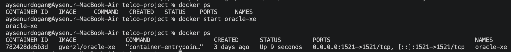
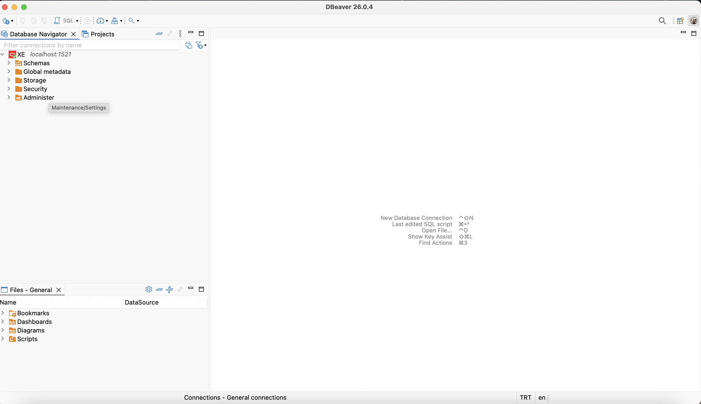
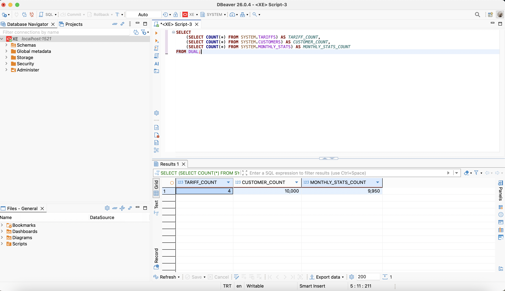
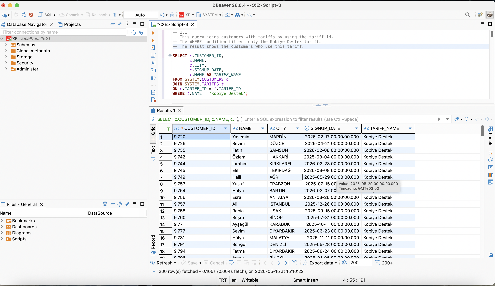
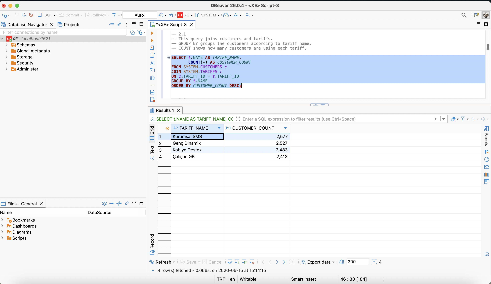
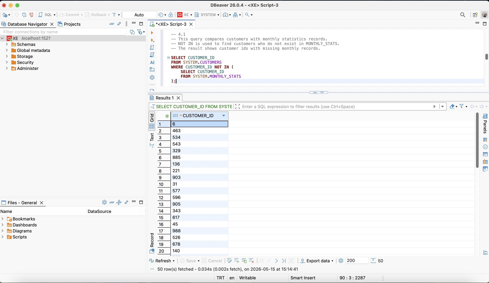
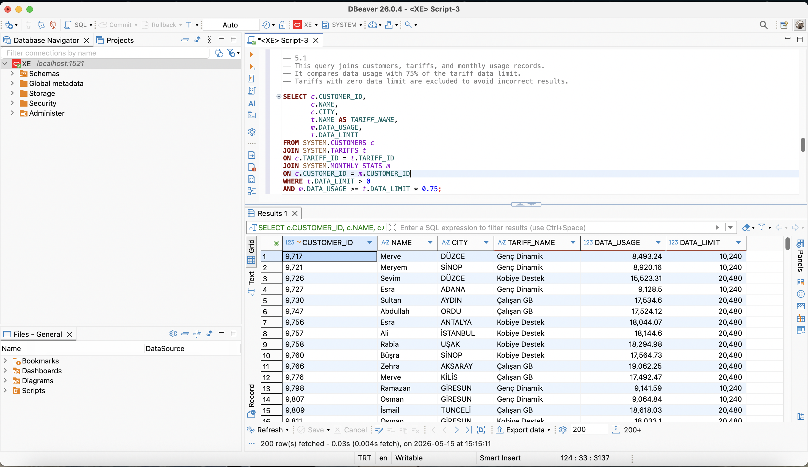
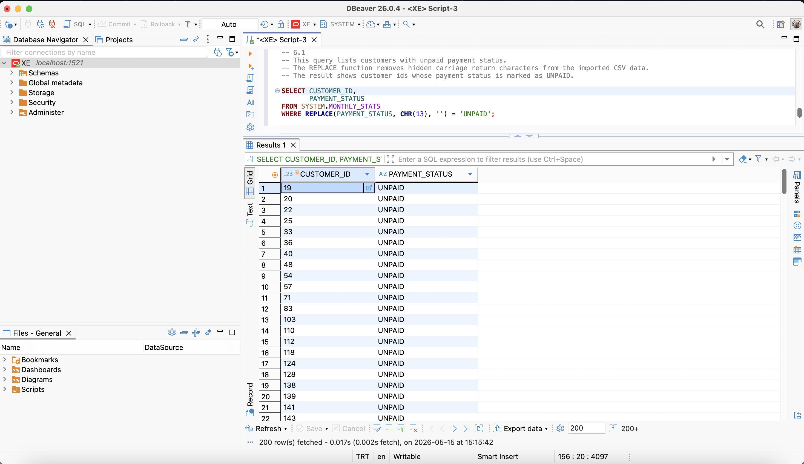

# Telco Database Analysis Project

This project was developed as part of the i2i Systems SQL internship evaluation case.

The project includes:

- Oracle XE database setup with Docker
- Table creation scripts
- CSV data import operations
- SQL analysis queries
- Data cleaning operations
- Customer and tariff usage analysis

---

# Technologies Used

- Oracle XE
- Docker
- DBeaver
- SQL

---

# Project Structure

    telco-project/
    │
    ├── CUSTOMERS.csv
    ├── TARIFFS.csv
    ├── MONTHLY_STATS.csv
    ├── TABLE_CREATION_SCRIPTS.sql
    ├── SOLUTIONS.sql
    ├── README.md
    └── screenshots/

---

# Database Screenshots

## Docker Container Running

---

## DBeaver Oracle XE Connection

---

## Database Record Counts

---

## Query 1.1 

---

## Query 2.1 

---

## Query 4.1 

---

## Query 5.1 

---

## Query 6.1

---

# Notes

- Oracle XE was deployed locally using Docker.
- DBeaver was used for database management and SQL query execution.
- CSV files were imported manually into Oracle XE tables.
- Hidden carriage return characters in PAYMENT_STATUS values were cleaned using the REPLACE function.
- All SQL queries were tested successfully on the imported dataset.